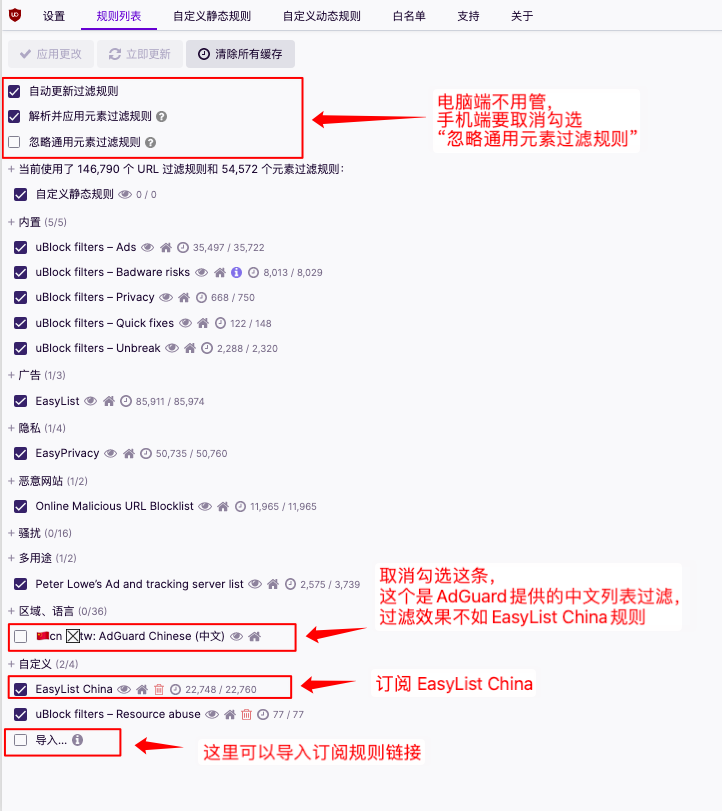
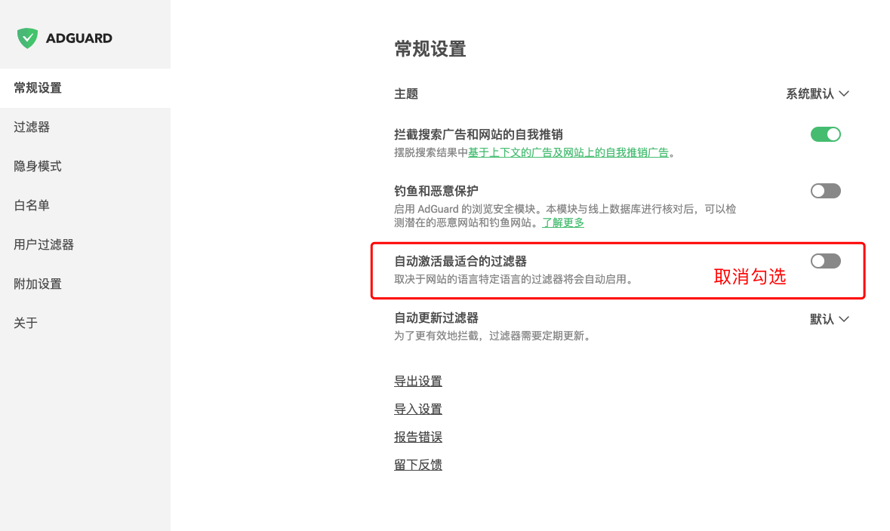
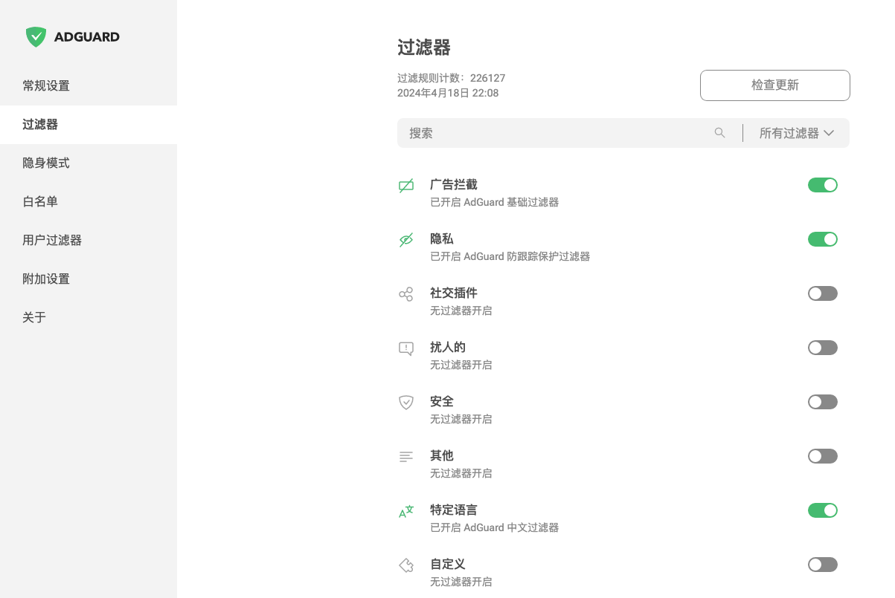
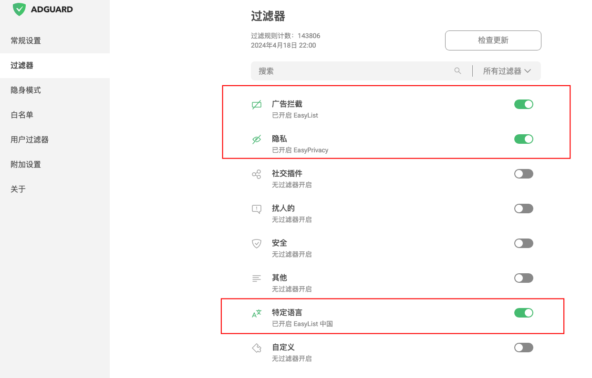
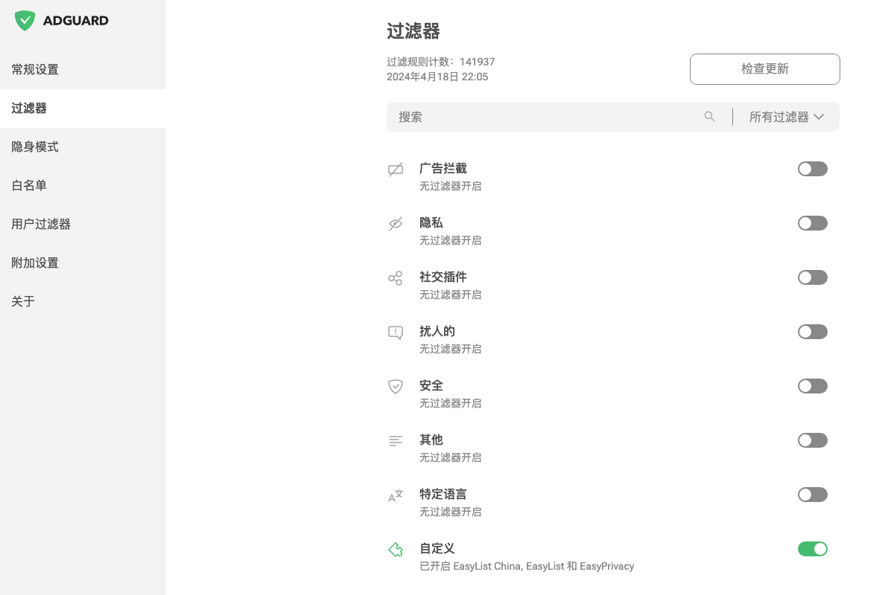
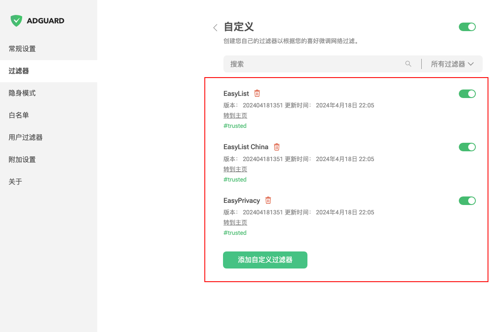

# 去广告过滤规则

## 浏览器插件推荐使用 uBlock Origin、AdGuard

- 优先推荐使用 uBlock，占用内存cpu低，效率快，很多过滤规则适配的也是uBlock，所以兼容性和过滤能力最强。
- AdGuard过滤 哎呦疼 的广告不太给力，不如 uBlock

- [uBlock Origin](https://www.crxsoso.com/webstore/detail/cjpalhdlnbpafiamejdnhcphjbkeiagm)

- [Adguard](https://www.crxsoso.com/webstore/detail/bgnkhhnnamicmpeenaelnjfhikgbkllg)

---

## 一些使用记录

Yandex 安卓版虽然可以安装插件，但是许多站点的视频 Yandex 浏览器无法正常加载播放。

2024.4.17 AdGuard 插件: jsdelivr 加速的、gitee的链接、ghproxy加速的订阅的链接不会自动更新，原因是合并的规则文件太大，经常无法订阅或订阅失败，而 ABP 官方提供的订阅链接则正常自动更新

uBlock 插件: jsdelivr 加速的文件 1M 以上的不会自动更新(严格来说是自动更新时文件太大下载失败了)

另外说一下，jsdelivr.net 时不时被墙，无法访问

github上面别人整合的规则非必要不使用，因为一般插件内有规则可以单独订阅，

这些集合的规则单文件体积太大(一般超过1MB的就属于大文件了)，很多超过10MB，订阅时比较容易出现卡顿/失败，AdGuard插件基本无法正常自动订阅更新的，uBlock Origin 也会偶尔更新失败。

订阅的规则要低于1MB(插件自带的那些过滤规则除外)，这种软件自动更新时才正常些，不容易失败。

---

## 规则列表

- EasyList
    - 用途：过滤英文站点广告
    - 订阅链接：[https://easylist-downloads.adblockplus.org/easylist.txt](https://easylist-downloads.adblockplus.org/easylist.txt)

- EasyList China
    - 用途：过滤中文站点广告
    - 订阅链接：[https://easylist-downloads.adblockplus.org/easylistchina.txt](https://easylist-downloads.adblockplus.org/easylistchina.txt)

- EasyPrivacy
    - 用途：隐私防护
    - 订阅链接：[https://easylist-downloads.adblockplus.org/easyprivacy.txt](https://easylist-downloads.adblockplus.org/easyprivacy.txt)

- CJX's Annoyance List (反自我推广,移除anti adblock,防跟踪规则列表)
    - 订阅链接：[https://filters.adtidy.org/extension/ublock/filters/220.txt](https://filters.adtidy.org/extension/ublock/filters/220.txt)

- 乘风视频过滤
    - 用途：过滤哎呦疼视频广告
    - 订阅链接：[https://cdn.jsdelivr.net/gh/xinggsf/Adblock-Plus-Rule@master/mv.txt](https://cdn.jsdelivr.net/gh/xinggsf/Adblock-Plus-Rule@master/mv.txt)
    - 订阅链接2: [https://raw.githubusercontent.com/xinggsf/Adblock-Plus-Rule/master/mv.txt](https://raw.githubusercontent.com/xinggsf/Adblock-Plus-Rule/master/mv.txt)
    - 订阅链接3：[https://fastly.jsdelivr.net/gh/xinggsf/Adblock-Plus-Rule@master/mv.txt](https://fastly.jsdelivr.net/gh/xinggsf/Adblock-Plus-Rule@master/mv.txt)

---

## 浏览器插件规则方案建议
### uBlock插件订阅方案

#### A方案

插件默认订阅即可，如果需要过滤一些哎哟疼的广告，可额外订阅一条乘风的过滤规则

##### 订阅参考图

### AdGuard 插件订阅方案

#### 设置一下 AdGuard

#### A方案

AdGuard 安装后默认订阅的内容，如果因为网络原因没有成功订阅，那么参考一下图片去订阅即可。不过还是建议使用方案B / C

##### 订阅参考图

#### B方案【推荐】

> 和 C 方案区别就是用的这几个是 AdGuard 提供的镜像规则，是从 ABP 官方那边镜像过来的

订阅 **EasyList**，**EasyList China**，**EasyPrivacy**

具体步骤 

第一步：“设置选项” --> “过滤器” --> “广告拦截” --> “EasyList”

第二步：“设置选项” --> “过滤器” --> “隐私” --> “EasyPrivacy”

第三步：“设置选项” --> “过滤器” --> “特定语言” --> “EasyList中国”

##### 订阅参考图

#### C 方案【推荐】

> 和 B 方案区别就是用的这几个是从 ABP 官方那边的，ABP规则的链接加载速度比较快

订阅 **EasyList**，**EasyList China**，**EasyPrivacy**

具体步骤 “设置选项” --> “过滤器” --> “自定义” --> “添加自定义过滤器”

##### 订阅参考图

---

## 一些项目地址
- [推荐阅读 cjxlist](https://github.com/cjx82630/cjxlist)

- [乘风过滤规则(针对哎哟疼的比较强大)](https://github.com/xinggsf/Adblock-Plus-Rule)

---
